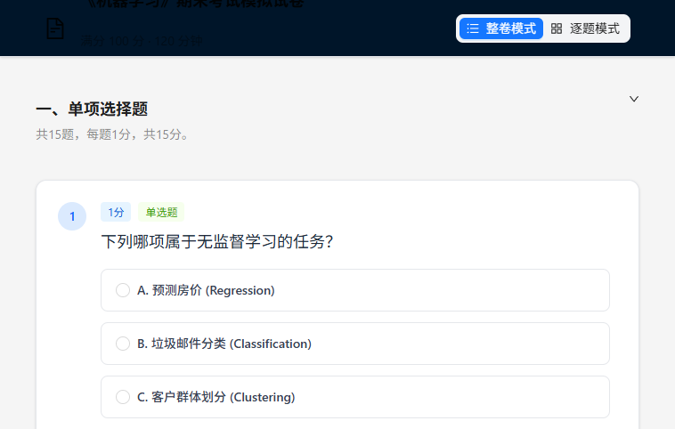

# ExamViz

一个 **JSON 驱动**的试卷/练习题渲染工具：把试卷定义成 JSON，在浏览器中完成 **渲染、作答、自动判分、查看解析**。



## 功能特性

- **两种答题模式**
  - **整卷模式（Full）**：按大题/章节折叠展示所有题目，右侧显示分数与进度
  - **逐题模式（Single）**：一次只展示一道题，底部提供上一题/下一题导航 + 右侧抽屉答题卡
- **从文件加载试卷 JSON**：点击页面右上角“加载 JSON”，直接导入 `*.json`
- **自动判分（客观题/部分题型）**
  - 单选 / 判断：对比答案
  - 多选：支持“选对得部分分、选错全扣”策略
  - 填空：按空计分（大小写不敏感）
  - 编程题：基于代码文本规范化后的对比（可展示参考答案）
- **提交后显示解析**：展示正确答案、解析文本、得分状态（正确/部分正确/错误/待评分）
- **LaTeX 渲染**：题目可通过 `isLatex: true` 启用公式渲染（KaTeX）

## 技术栈

- React 19 + TypeScript
- Vite 7
- Zustand（状态管理）
- Ant Design（UI）
- Tailwind CSS（样式）
- KaTeX + react-latex-next（公式渲染）
- react-syntax-highlighter（代码高亮）

## 环境要求

- Node.js：`^20.19.0 || >=22.12.0`（Vite 7 要求）
- 包管理器：推荐 `pnpm`（本仓库包含 `pnpm-lock.yaml`）

## 快速开始

```bash
pnpm install
pnpm dev
```

构建与预览：

```bash
pnpm build
pnpm preview
```

代码检查：

```bash
pnpm lint
```

## 使用说明

1. 启动项目后，页面会默认加载示例试卷：`src/assets/ML1.json`
2. 点击右上角 **“加载 JSON”**，选择你自己的试卷文件
3. 通过顶部切换：
   - **整卷模式**：适合完整模拟
   - **逐题模式**：适合刷题；支持底部导航与抽屉“答题卡”
4. 点击 **“提交试卷/提交”**：
   - 可自动判分的题会立即计算得分
   - `short_answer` / `calculation`（以及无参考答案的 `coding`）会显示为 **待评分**

## 试卷 JSON 协议（核心）

项目内 TypeScript 类型定义位于：`src/types/exam.ts`。下面是与当前实现一致的字段说明与示例。

### 1) 顶层结构

```ts
export interface ExamPaper {
  examMeta: {
    id: string;
    title: string;
    totalScore: number;
    duration: number;     // 分钟
    createTime: string;   // ISO 字符串
    description: string;
  };
  sections: Array<{
    id: string;
    title: string;
    description: string;
    type: string;         // 目前主要用于展示
    questions: Question[];
  }>;
}
```

### 2) 题目结构

```ts
export type QuestionType =
  | 'single_choice'
  | 'multiple_choice'
  | 'true_false'
  | 'fill_in_blank'
  | 'short_answer'
  | 'calculation'
  | 'coding';

export interface Question {
  id: string;                 // 题目唯一 ID（用于保存作答）
  idx: number;                // 展示序号（如 1、2、3…）
  score: number;              // 该题分值
  type: QuestionType;         // 题型
  content: string;            // 题干（支持换行）
  options?: Array<{           // 选择题/判断题选项（判断题可省略）
    label: string;            // A/B/C… 或 True/False
    value: string;            // 选项文本
  }>;
  correctAnswer: string | string[]; // 参考/正确答案（随题型变化）
  analysis: string;           // 解析（提交后展示）

  // 可选扩展
  isLatex?: boolean;          // true 时 content 使用 LaTeX 渲染
  codeLanguage?: string;      // coding：参考答案高亮语言（如 "python"）
  defaultCode?: string;       // coding：输入框占位/初始提示
}
```

### 3) 各题型 `correctAnswer` 约定

| 题型 `type` | `correctAnswer` 格式 | 是否自动判分 | 备注 |
| --- | --- | --- | --- |
| `single_choice` | `"A"` / `"B"` / `"C"`…（选项 `label`） | 是 | 大小写不敏感（内部会规范化） |
| `multiple_choice` | `["A","C"]`（选项 `label` 数组） | 是 | **含错项=0 分**；全对满分；部分对按比例给分 |
| `true_false` | `"True"` / `"False"`（选项 `label`） | 是 | 若未提供 `options`，默认 True/False |
| `fill_in_blank` | `["答案1","答案2"]` | 是 | 按空给分；大小写不敏感；空格会被 trim |
| `short_answer` | `"参考答案文本"` | 否（待评分） | 提交后展示参考答案与解析 |
| `calculation` | `"参考答案/过程"` | 否（待评分） | 提交后展示参考答案与解析 |
| `coding` | `"参考代码"` | 是/否 | 有 `correctAnswer` 才会自动判分；否则为待评分 |

### 4) 填空题的“空位数量”

`fill_in_blank` 的空位数量优先取 `correctAnswer.length`；如果 `correctAnswer` 不是数组，则会尝试根据题干中的 `___` 统计空位数。

示例：

```json
{
  "id": "Q_FILL_01",
  "idx": 1,
  "score": 5,
  "type": "fill_in_blank",
  "content": "CSS 中，id 选择器权重是 ___，类选择器权重是 ___。",
  "correctAnswer": ["100", "10"],
  "analysis": "ID 为 100，class 为 10。"
}
```

### 5) LaTeX 示例

```json
{
  "id": "Q_LATEX_01",
  "idx": 1,
  "score": 5,
  "type": "calculation",
  "content": "计算积分：$\\int_0^1 x^2 \\mathrm{d}x$。",
  "correctAnswer": "1/3",
  "analysis": "原函数为 $x^3/3$，代入上下限得到 1/3。",
  "isLatex": true
}
```

### 6) 最小可运行试卷示例（覆盖常见题型）

> 提示：这是一个“可以直接导入页面”的完整示例（字段可按需增删，但需保证 JSON 合法）。

```json
{
  "examMeta": {
    "id": "DEMO_EXAM_001",
    "title": "JSON2Test 示例试卷",
    "totalScore": 20,
    "duration": 30,
    "createTime": "2026-01-10T00:00:00Z",
    "description": "用于演示各题型的数据结构与判分规则。"
  },
  "sections": [
    {
      "id": "SEC_01",
      "title": "一、选择与判断",
      "description": "单选 / 多选 / 判断",
      "type": "objective",
      "questions": [
        {
          "id": "Q_SC_01",
          "idx": 1,
          "score": 2,
          "type": "single_choice",
          "content": "Vite 默认的开发命令是？",
          "options": [
            { "label": "A", "value": "vite" },
            { "label": "B", "value": "vite build" },
            { "label": "C", "value": "vite preview" }
          ],
          "correctAnswer": "A",
          "analysis": "开发环境一般直接运行 vite（对应 npm script: dev）。"
        },
        {
          "id": "Q_MC_01",
          "idx": 2,
          "score": 4,
          "type": "multiple_choice",
          "content": "以下哪些属于前端常见的状态管理方案？",
          "options": [
            { "label": "A", "value": "Redux" },
            { "label": "B", "value": "Zustand" },
            { "label": "C", "value": "Zod" },
            { "label": "D", "value": "MobX" }
          ],
          "correctAnswer": ["A", "B", "D"],
          "analysis": "Zod 是校验库；Redux/Zustand/MobX 属于状态管理。"
        },
        {
          "id": "Q_TF_01",
          "idx": 3,
          "score": 2,
          "type": "true_false",
          "content": "React 中的 state 变化会触发 UI 重新渲染。",
          "correctAnswer": "True",
          "analysis": "React 采用声明式渲染，状态变化会驱动视图更新。"
        }
      ]
    },
    {
      "id": "SEC_02",
      "title": "二、填空与主观题",
      "description": "填空 / 简答 / 编程",
      "type": "mixed",
      "questions": [
        {
          "id": "Q_FIB_01",
          "idx": 4,
          "score": 4,
          "type": "fill_in_blank",
          "content": "CSS 中，id 选择器权重是 ___，类选择器权重是 ___。",
          "correctAnswer": ["100", "10"],
          "analysis": "权重常见记法：id=100，class=10。"
        },
        {
          "id": "Q_SA_01",
          "idx": 5,
          "score": 4,
          "type": "short_answer",
          "content": "简述你理解的“前端工程化”包含哪些方面？",
          "correctAnswer": "参考点：构建工具、规范化、测试、CI/CD、发布与监控等。",
          "analysis": "该题为主观题，当前实现标记为待评分。"
        },
        {
          "id": "Q_CODE_01",
          "idx": 6,
          "score": 4,
          "type": "coding",
          "content": "请写一个函数 add(a, b)，返回 a + b。",
          "defaultCode": "def add(a, b):\\n    # TODO\\n    pass\\n",
          "codeLanguage": "python",
          "correctAnswer": "def add(a, b):\\n    return a + b\\n",
          "analysis": "当前编程题判分为“规范化后的文本对比”。"
        }
      ]
    }
  ]
}
```

## 判分规则（当前实现）

判分逻辑位于：`src/utils/grading.ts`。

- **未作答**：0 分，状态 `unanswered`
- **单选/判断**：答案相同得满分，否则 0 分
- **多选**：
  - 若选择中包含任意一个错误选项：0 分
  - 只选对一部分：按 `选对数量 / 正确答案数量 * 分值` 计分（保留两位小数）
- **填空**：按空计分，`正确空数 / 总空数 * 分值`（保留两位小数）
- **简答/计算**：状态 `pending`（待人工评分），默认 0 分
- **编程**：
  - 若 `correctAnswer` 为空：状态 `pending`
  - 否则对代码进行规范化（换行统一、去除行尾空格等）后做文本对比

## 目录结构

```
.
├─ public/
├─ src/
│  ├─ assets/                 # 示例试卷 JSON（如 ML1.json）
│  ├─ components/             # UI 组件（题卡/答题卡/导航等）
│  ├─ store/                  # Zustand store
│  ├─ types/                  # TS 类型（ExamPaper/Question 等）
│  └─ utils/                  # 判分/统计逻辑
├─ index.html
├─ vite.config.ts
└─ package.json
```

## 扩展开发（新增题型）

如果你想新增题型（例如：匹配题、排序题、拖拽题），建议按以下顺序改动：

1. `src/types/exam.ts`：扩展 `QuestionType` 与 `Question` 字段
2. `src/components/AnswerInputs/`：新增输入组件
3. `src/components/QuestionCard.tsx`：在 `switch (question.type)` 中接入新组件
4. `src/utils/grading.ts`：实现对应的判分逻辑（或标记为 `pending`）

## 常见问题

- **加载 JSON 失败**：请检查是否为合法 JSON；至少要包含 `examMeta.title` 与 `sections` 数组
- **中文乱码/显示异常**：建议将 JSON 文件保存为 UTF-8 编码
- **编程题自动判分太严格**：当前是“规范化后的文本对比”，不是语义对比；可选择把该题设为待评分（将 `correctAnswer` 置空）

## License

本项目暂未提供 LICENSE，如需开源发布请补充 `LICENSE` 文件并注明协议。
